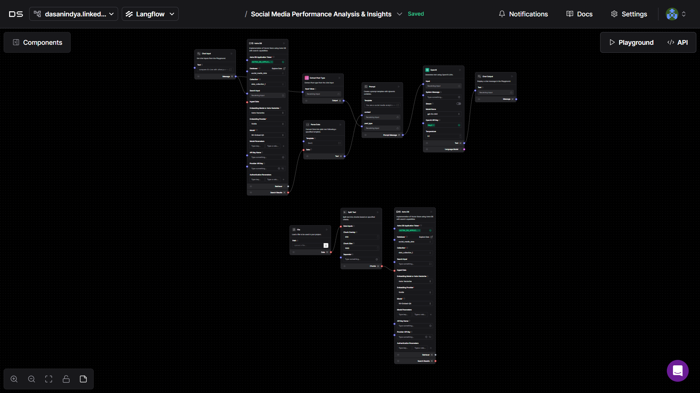

# Social Media Insights Langflow
This project is an AI-powered tool developed for the **Supermind Hackathon**, designed to analyze social media engagement data and deliver valuable insights.


🙏 Welcome to the **Pre-Hackathon Assignment: Social Media Performance Analysis** submission by **Team AI Avengers**. Connect with our Team:

- 👨🏻‍💻 [**Anindya Das**](https://www.linkedin.com/in/dasanin/)
- 👨🏻‍💻 [**Pratik Sonawane**](https://www.linkedin.com/in/pratiksonawane/)  
- 👩🏻‍💻 [**Devika Kandagatla**](https://www.linkedin.com/in/devika-kandagatla-091013186/)
- 👩🏻‍💻 [**Chukka Keerthana**](https://www.linkedin.com/in/chukka-keerthana-058b54252/)


## 📋 Table of Contents
- [Assignment Objective](#-assignment-objective)
- [Task Details](#-task-details)
- [About this Project](#--about-this-project)
- [Local Setup](#️-local-setup)
- [We are Live!!](#-we-are-live-)
- [Application Screenshot](#-application-screenshots)
- [Langflow Screenshots](#-langflow-screenshots)
- [About SuperMind Hackathon](#-about-supermind-hackathon)

## 🎯 Assignment Objective
Develop a basic analytics module utilizing [Langflow](https://www.langflow.org/) and [DataStax](https://www.datastax.com/) to analyze engagement data from mock social media accounts.

## 📜 Task Details
1. **Fetch Engagement Data:**
    - Create a small dataset simulating social media engagement (e.g., likes, shares, comments, post types)
    - Store this data in DataStax Astra DB.
2. **Analyze Post Performance:**
    - Using Langflow, construct a simple flow that:
        - Accepts post types (e.g., carousel, reels, static images) as input.
        - Queries the dataset in Astra DB to calculate average engagement metrics for each post type.
3. **Provide Insights:**
    - Utilize GPT integration in Langflow to generate simple insights based on the data.
    -  *Example outputs:*
        - Carousel posts have 20% higher engagement than static posts.
        - Reelsdrive 2x more comments compared to other formats.

## 🤖  About this Project
This project showcases an **AI-powered tool** designed to analyze social media engagement data and provide valuable insights.

We leveraged the **Streamlit** library in python to build an intuitive and user-friendly interface. The tool allows users to input various post types, which are then sent to the LangFlow API. The API processes the inputs through an AI-driven workflow, generates key insights, and returns them to be displayed seamlessly on the UI.

## 🛠️ Local Setup
- Python version `3.9+`  
- 🚩Before proceeding further make sure that your langflow workflow & Astra DB already in place & working.
- Clone the repo and move into the project
    ```sh
    git clone https://github.com/Anindya-Das02/Social-Media-Insights-Langflow.git
    ```
- Move into project 
    ```sh
    cd Social-Media-Insights-Langflow
    ```
- Start the virtual
    - if using linux/bash:
        ```sh
        source venv/Scripts/activate
        ```
    - if using windows cmd:
        ```cmd
        venv\Scripts\activate
        ```
- Install requirements
    ```sh
    pip install -r requirements.txt
    ```
- In `app.py` replace `LANGFLOW_ID`, `APPLICATION_TOKEN` & `ENDPOINT` with your token values. **NOTE:** *the tokens currently used in the `app.py` is only for temporary demonstration, & will be removed/disabled in the near future.*
- Once the token are filled properly, start the `streamlit` server using
    ```sh
    streamlit run app.py
    ```
    your app should start with the following message:
    ```
    You can now view your Streamlit app in your browser.

    Local URL: http://localhost:8501
    ```
## 🌐 We are Live !!
👉 **Checkout our Application live here: [team-ai-avengers-streamlit-app 🚀](https://team-ai-avengers.streamlit.app/)**

## 📊 Application Screenshots


## ֎ Langflow Screenshots



## 🌏 About SuperMind Hackathon
Check out [SuperMind Hackathon](https://hack.level.game/)
